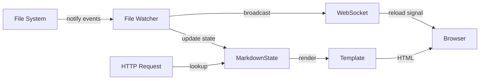
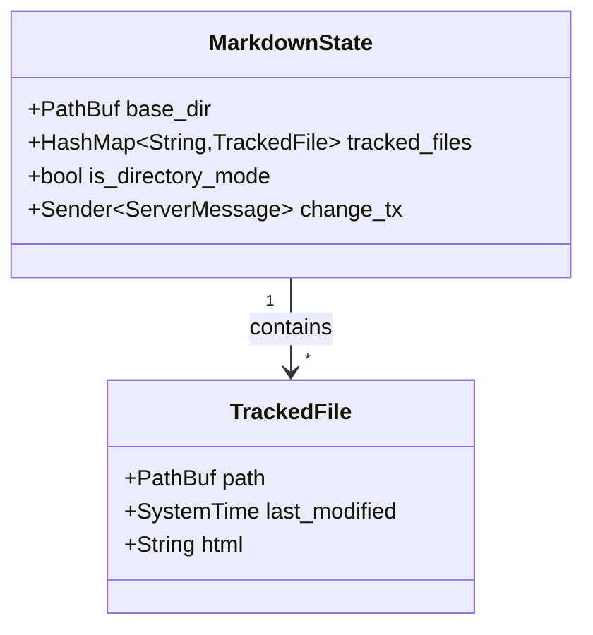

# mdserve Architecture

## Overview

mdserve is a simple HTTP server for markdown preview with live reload. It supports both single-file and directory modes with a unified codebase.

**Core principle**: Always work with a base directory and a list of tracked files (1 or more).



## Modes

### Single-File Mode
```bash
mdserve README.md
```
- Watches parent directory
- Tracks single file
- No navigation sidebar

### Directory Mode
```bash
mdserve ./docs/
```
- Watches specified directory
- Tracks all `.md` and `.markdown` files
- Shows navigation sidebar

### Recursive Directory Mode
```bash
mdserve ./docs/ --recursive --open
```
- Walks below the specified directory and tracks markdown files at any depth
- Uses relative paths as file keys and rooted, percent-encoded URLs
- Groups sidebar entries by relative parent directory while displaying each
  file's basename
- Does not follow symlinks; hidden paths and paths excluded by `.gitignore` or
  `.ignore` are skipped at startup and when discovering new files/directories
- Keeps the same WebSocket reload behavior and in-memory rendering cache

Ignore rules also apply outside Git repositories. Changes to ignore files are
not themselves reload triggers and do not evict tracked files; restart to fully
apply new rules. Permanent deletions and renames retain cached entries until
restart, preserving the existing behavior during editors' replacement saves.
An empty directory still fails startup because there is no Markdown file to serve.

## Architecture

### State Management

Central state stores:
- Base directory path
- HashMap of tracked files (relative path → metadata + pre-rendered HTML)
- Directory mode flag (determines UI)
- Recursive mode flag (determines discovery and sidebar grouping)
- WebSocket broadcast channel



Mode is determined by user intent, not file count:
- `mdserve /docs/` with 1 file shows sidebar
- `mdserve single.md` never shows sidebar

**Example states:**

Single-file mode:
```
base_dir = /path/to/docs/
tracked_files = {
  "README.md": TrackedFile { ... }
}
is_directory_mode = false
```

Directory mode:
```
base_dir = /path/to/docs/
tracked_files = {
  "api.md": TrackedFile { ... },
  "guide.md": TrackedFile { ... },
  "README.md": TrackedFile { ... }
}
is_directory_mode = true
recursive_mode = false
```

Recursive directory mode uses keys such as `api/auth.md` and
`guides/getting-started.markdown`; each sidebar item also receives its
relative parent (`dir`), basename, and rooted percent-encoded URL (`href`).

### Live Reload

Uses [notify](https://github.com/notify-rs/notify) crate to watch the base
directory (recursively when `--recursive` is enabled):
- Create/modify: Refresh file, add if new (directory mode only)
- Delete/rename-away: Keep cached entry to tolerate editor replacement saves
- Rename arrival: Refresh the tracked file or discover a new visible file
- New/moved-in directory: Discover visible descendants in recursive mode
- Successful updates and additions trigger WebSocket reload broadcasts

File changes flow:
1. File system event detected by `notify`
2. Markdown re-rendered to HTML
3. State updated (refresh/add tracked file)
4. `ServerMessage::Reload` broadcast via WebSocket channel
5. All connected clients receive reload message
6. Clients execute `window.location.reload()`

### Routing

Single unified router handles both modes:
- `GET /` → First file alphabetically
- `GET /<path>.md` → Specific markdown file (including nested paths in
  recursive mode)
- `GET /<path>.<ext>` → Images from base directory
- `GET /ws` → WebSocket connection
- `GET /mermaid.min.js` → Bundled Mermaid library

Requested paths are resolved beneath the configured base directory, preventing
directory traversal.

### Rendering

Uses [MiniJinja](https://github.com/mitsuhiko/minijinja) (Jinja2 template syntax) with templates embedded at compile time via [minijinja_embed](https://github.com/mitsuhiko/minijinja/tree/main/minijinja-embed).

Conditional template rendering:
- Directory mode: Includes navigation sidebar with active file highlighting
- Single-file mode: Content only
- Both use same pre-rendered HTML from state

Template variables:
- `content`: Pre-rendered markdown HTML
- `mermaid_enabled`: Boolean flag, conditionally includes Mermaid.js when diagrams detected
- `show_navigation`: Controls sidebar visibility
- `files`: List of tracked files (directory mode)
- `current_file`: Active file name (directory mode)
- `recursive_mode`: Whether the sidebar uses directory grouping

## Design Decisions

**Unified architecture**: Single code path handles both single-file and directory modes. Mode determined by user intent, not file count.

**Pre-rendered caching**: All tracked files rendered to HTML in memory on startup and file change. Serving always from memory, never from disk.

**Opt-in recursion**: Flat directory mode stays simple and compatible by
default; `--recursive` adds nested discovery and watching only when requested.
Recursive traversal does not follow directory symlinks and keeps all rendered
files in memory.

**Server-side logic**: Most logic lives server-side (markdown rendering, file tracking, navigation, active file highlighting, live reload triggering). Client-side JavaScript minimal (theme management, reload execution).

## Constraints

- Flat by default; recursive traversal is opt-in
- Alphabetical file ordering only
- All files pre-rendered in memory
